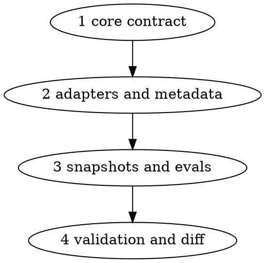

# Plan: executor draft-PR bootstrap

## Context

Office-core currently treats pushes and pull requests as planner-owned, while Auto Office's
executor contract already assigns push and PR creation to the executor. The launch path therefore
has no single rule for making a run externally visible or resumable. This change makes the shared
core and all three adapters agree: an executor bootstraps one draft PR from a plan-only first
commit, reports every milestone in that PR, and leaves final readiness, plan removal, and merge to
closeout.

Tracking issue: #1
Plan path: `docs/plans/executor-draft-pr-bootstrap.md`
Branch: `feat/office-core-executor-draft-pr`

## Global Constraints

- Edit only the root `office-core/` source for shared protocol changes. Re-vendor snapshots with
  `scripts/vendor-core.sh`; never hand-edit a vendored snapshot.
- Align `codex-office`, `agy-office`, and `auto-office` with the new core contract, including their
  hubs, executor briefs, closeout guidance, compatibility declarations, plugin versions, changelogs,
  and ownership matrix where those surfaces state the affected rules.
- Preserve the pre-existing uncommitted changes in:
  - `auto-office/references/routing-outcomes.md`
  - `auto-office/skills/claude-cli-send-message/SKILL.md`
  - `auto-office/skills/claude-cli/SKILL.md`
- The plan must be tracked at `docs/plans/<slug>.md` during execution. The executor's first branch
  commit contains only that plan file. Closeout removes the plan in the final pre-merge commit.
- The draft PR body must reference both the plan path and tracking issue #1. Every milestone gets a
  resumability comment containing its name, commit range, verification output, and next resume point.
- The executor may push the named feature branch and create the draft PR because the approved plan
  names those exact actions. It may not merge, mark the PR ready, delete the plan, or perform other
  planner-held actions.

### Blast-radius ceiling

This run may modify documentation, protocol text, plugin metadata, changelogs, evaluation fixtures,
and vendored snapshots in this repository only. It may read repository and GitHub metadata, push
`feat/office-core-executor-draft-pr`, create one draft PR referencing #1, and post milestone
comments on that PR. It may not merge a PR, mark a PR ready for review, alter repository settings,
touch credentials, send messages outside GitHub issue/PR bookkeeping, modify the three protected
pre-existing files, or make production changes.

## Numbered tasks

1. Update the root office-core protocol and bump `office-core/VERSION` from `4.0.0` to `5.0.0`.
   Define the required executor bootstrap, tracked plan path, plan-only first commit, named-branch
   push, draft PR body, milestone comments, fail-closed bootstrap, and final pre-merge plan removal.
   Reconcile role ownership and milestone/closeout language. Strategy: INLINE. Verify with targeted
   searches and protocol consistency checks.
2. Update Codex, Agy, and Auto Office hubs, executor packets, closeout references, planning guidance,
   and the ownership matrix to implement the core contract for every executor route. Update plugin
   metadata, compatibility ranges, and changelogs for the core-major release. Strategy: PRO.
   Verify that no adapter still says the executor cannot push/open a PR or that milestones merge
   before final closeout, except where the planner-owned merge rule is being stated intentionally.
3. Re-vendor the root core into all three plugin snapshots and add focused evaluation coverage for
   plan-only bootstrap, draft status, PR references, milestone comments, fail-closed startup, and
   pre-merge plan removal. Strategy: FLASH. Verify with `scripts/vendor-core.sh` and the repository
   checks.
4. Run `scripts/check-plugins.sh`, inspect the complete intended diff, and record any unresolved
   issue in the handoff/PR body. Strategy: INLINE. Do not modify protected paths.

## Dependency graph

| Wave | Tasks | Depends on | Touches |
|---|---|---|---|
| 1 | 1 | none | `office-core/` |
| 2 | 2 | 1 | `codex-office/`, `agy-office/`, `auto-office/`, `docs/rule-ownership-matrix.md` |
| 3 | 3 | 2 | vendored `office-core/` snapshots, evaluation fixtures |
| 4 | 4 | 3 | validation output only |

## Milestones

- **M1 — Core contract:** task 1 is complete and the shared protocol is internally consistent.
- **M2 — Adapter alignment:** task 2 is complete and all three adapters state the same launch and
  closeout ownership.
- **M3 — Packaged and validated:** tasks 3–4 are complete, snapshots are fresh, and all checks pass.

Each milestone is committed on the branch and documented as a comment on the single draft PR. The
PR remains draft until final reviewer approval; no milestone is merged independently.

## named_actions:

- `git add docs/plans/executor-draft-pr-bootstrap.md && git commit -m "plan: bootstrap executor draft PR"`;
  target: this repository and branch; changes: records the approved plan as the branch's first
  commit; precondition: branch is at `BASE` with no earlier branch commits and protected dirty paths
  remain unstaged; revert target: reset the feature branch before its first commit; read-back:
  `git show --stat --oneline HEAD` lists only this plan file.
- `git push origin feat/office-core-executor-draft-pr`; target: GitHub origin; changes: publishes
  the named branch; precondition: the plan-only first commit exists and the remote is `origin`;
  revert target: delete the feature branch only during authorized closeout; read-back:
  `git ls-remote --heads origin feat/office-core-executor-draft-pr` matches `HEAD`.
- `gh pr create --draft --base main --head feat/office-core-executor-draft-pr --title "feat: executor draft-PR bootstrap" --body "Plan: docs/plans/executor-draft-pr-bootstrap.md\nTracking issue: #1"`; target: GitHub
  draft PR; changes: creates one draft PR whose body links `docs/plans/executor-draft-pr-bootstrap.md`
  and references `#1`; precondition: the named branch is pushed and no PR exists for it; revert
  target: close the draft PR without merging if creation was mistaken; read-back:
  `gh pr view --json isDraft,headRefName,body` confirms draft state, branch, plan, and issue.
- `gh pr comment <number> --body ...`; target: the same GitHub PR; changes: records each milestone's
  commit range, verification output, and next resume point; precondition: milestone criteria are
  green; revert target: edit/delete a mistaken comment during closeout; read-back: `gh pr view`
  shows the comment.

## Out of scope

- Merging this implementation PR or marking it ready for review in this run.
- Modifying the three protected pre-existing files.
- Changing executor models, CLI flags unrelated to Git/PR bootstrap, reviewer floors, or production
  deployment behavior.
- Rewriting historical changelog entries or unrelated ownership-matrix inaccuracies.
